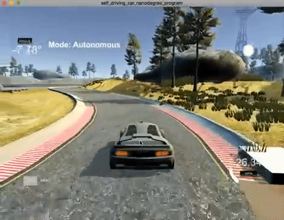

# CarND-Controls-PID 
Self-Driving Car Engineer Nanodegree Program
This project implements a PID controller for keeping the car on track autonomously by adusting the steering angle.

---
## Describe the effectes of PID components
### PID controller

PID controllers are a contrl loop feedback mechanism widely used. The error between the measured and the referenced value is fed into the PID controller as an input signal. The PID controller continuously calculates an error function and applies corrections based on the proportion, integral and derivative term. In the this project, a car simulator produces the error signal as the distance between the actual car position on the road and a reference trajectory, known as cross-track error (cte). The PID controller is designed to minimize the distance to this reference trajectory. The control output of the PID controller in this project is the steering angle. 

### The effectes of P - proportional 
The proportional gain computes an output proportional to the cross-track error. This part of the the controller enables the vehicle
to quickly react to changes in the CTE, e.g. due to sharp turns. If the proportional gain is large, the control system tends to be unstable. The proportional gain contributes a control output to the steering angle of the form  `-K_p cte` with a positive constant `K_p`.

### The effects of D - differential

The differential gain decides how much the error's rate of change is used when computing the response. if the referenced setport is geeting closer the response must be smoothed in order not be overshoot the target. The differential gain contributes a control output of the form `-K_d d/dt cte`, with a positive constant `K_d`. and this component is able to make the system stable.

### The effects of I - integral

The integral gain contributes in proportion to both the magnitude of the error and duration of the error, so the controller is able to eliminate the residual steady-state error that occurs with a pure proportional controller and deal with the system biases. The corresponding contribution to the steering angle is given by `-K_i sum(cte)`. If the vehicle has a bias in its steering mechanism, or if there were a constant cross wind, a PD controller alone would not be able to keep the vehicle on the intended trajectory path. This allows to reduce proportional gain, which causes oscillations at high speeds. It is also beneficial to limit the memory of this term to avoid overshooting. 

## Hyperparameter Tuning

In this project, parameters were manually tuned by qualitatively inspecting the driving behaviour in the simulator in response to parameter's changes. This was important as the slightly wrong parameters quickly lead to the car to leave the track and thus resulted to invalidating optimization. So there is a requirment for manually restart of the simulator. Once I found parameters that were able to get the car around the track reliably, I tried to take the pedestrian approach, because it provides an intuitive understanding of thethe importance of the different contributions. 

The mechanism of this algorithm: firstly, single P controller for one setpoint with K_i and K_d = 0; then increase K_d until oscillations subside; and finally,  in case of crashes: find cause. If the cause is slow reactivity, it needs to reduce streering angle smoothing and increase K_p or K_i accordingly, and vice versa.

The parameters were chosed with the trial and error method and finally got the hyperparameters: Kp=0.01, Ki=0.0001 and Kd=4.0 with the speed below 25 mph. This speed is controlled by a simple proportional gain controller. I firstly fined a value of Kp which maintain the car in the center-line with some oscillation. The Kd was turned to reduce the oscillation and finally the Ki was found to reduce the steady-state differences. I firstly tried the Kp=0.05, Ki=0.0 and Kd=0.0, and it results in oscillat significantly at curves. Then I tried to increase the value of Kp to 0.5 but results in a steep turn. With increasing the value of Ki, the car could maintain in the centre line with little variance. Fially, I tried to update all three parameters in the same logic and eventually find the parameters with best performance. 

The resulted gif is make into gif as below. 

<table style="width:100%">
  <tr>
    <th>
      

       
      

    </th>
  </tr>
  </table>

## Dependencies

* cmake >= 3.5
 * All OSes: [click here for installation instructions](https://cmake.org/install/)
* make >= 4.1
  * Linux: make is installed by default on most Linux distros
  * Mac: [install Xcode command line tools to get make](https://developer.apple.com/xcode/features/)
  * Windows: [Click here for installation instructions](http://gnuwin32.sourceforge.net/packages/make.htm)
* gcc/g++ >= 5.4
  * Linux: gcc / g++ is installed by default on most Linux distros
  * Mac: same deal as make - [install Xcode command line tools]((https://developer.apple.com/xcode/features/)
  * Windows: recommend using [MinGW](http://www.mingw.org/)
* [uWebSockets](https://github.com/uWebSockets/uWebSockets) == 0.13, but the master branch will probably work just fine
  * Follow the instructions in the [uWebSockets README](https://github.com/uWebSockets/uWebSockets/blob/master/README.md) to get setup for your platform. You can download the zip of the appropriate version from the [releases page](https://github.com/uWebSockets/uWebSockets/releases). Here's a link to the [v0.13 zip](https://github.com/uWebSockets/uWebSockets/archive/v0.13.0.zip).
  * If you run OSX and have homebrew installed you can just run the ./install-mac.sh script to install this
* Simulator. You can download these from the [project intro page](https://github.com/udacity/CarND-PID-Control-Project/releases) in the classroom.

## Basic Build Instructions

1. Clone this repo.
2. Make a build directory: `mkdir build && cd build`
3. Compile: `cmake .. && make`
4. Run it: `./pid`. 

## Editor Settings

We've purposefully kept editor configuration files out of this repo in order to
keep it as simple and environment agnostic as possible. However, we recommend
using the following settings:

* indent using spaces
* set tab width to 2 spaces (keeps the matrices in source code aligned)

## Code Style

Please (do your best to) stick to [Google's C++ style guide](https://google.github.io/styleguide/cppguide.html).

## Project Instructions and Rubric

Note: regardless of the changes you make, your project must be buildable using
cmake and make!

More information is only accessible by people who are already enrolled in Term 2
of CarND. If you are enrolled, see [the project page](https://classroom.udacity.com/nanodegrees/nd013/parts/40f38239-66b6-46ec-ae68-03afd8a601c8/modules/f1820894-8322-4bb3-81aa-b26b3c6dcbaf/lessons/e8235395-22dd-4b87-88e0-d108c5e5bbf4/concepts/6a4d8d42-6a04-4aa6-b284-1697c0fd6562)
for instructions and the project rubric.

## Hints!

* You don't have to follow this directory structure, but if you do, your work
  will span all of the .cpp files here. Keep an eye out for TODOs.

## Call for IDE Profiles Pull Requests

Help your fellow students!

We decided to create Makefiles with cmake to keep this project as platform
agnostic as possible. Similarly, we omitted IDE profiles in order to we ensure
that students don't feel pressured to use one IDE or another.

However! I'd love to help people get up and running with their IDEs of choice.
If you've created a profile for an IDE that you think other students would
appreciate, we'd love to have you add the requisite profile files and
instructions to ide_profiles/. For example if you wanted to add a VS Code
profile, you'd add:

* /ide_profiles/vscode/.vscode
* /ide_profiles/vscode/README.md

The README should explain what the profile does, how to take advantage of it,
and how to install it.

Frankly, I've never been involved in a project with multiple IDE profiles
before. I believe the best way to handle this would be to keep them out of the
repo root to avoid clutter. My expectation is that most profiles will include
instructions to copy files to a new location to get picked up by the IDE, but
that's just a guess.

One last note here: regardless of the IDE used, every submitted project must
still be compilable with cmake and make./
